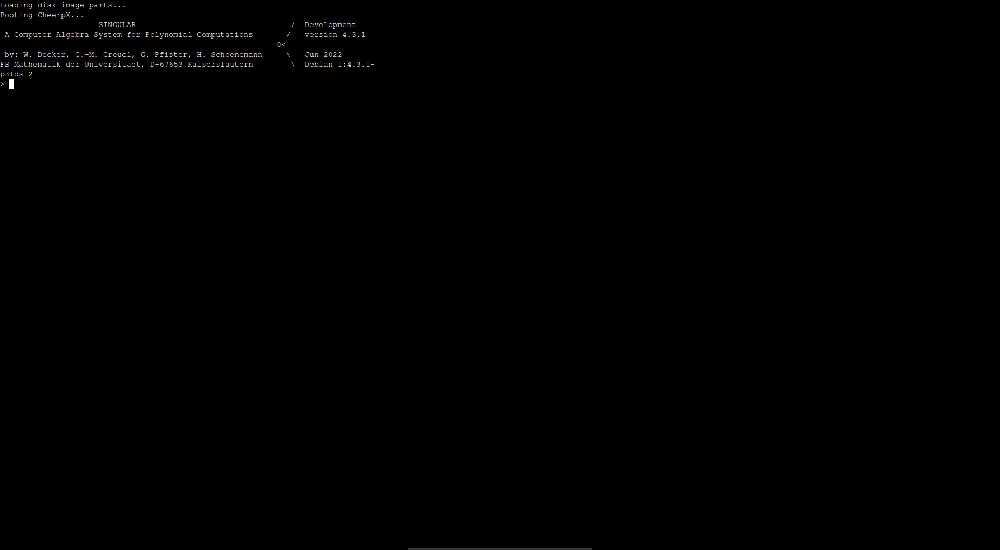

Singular in Browser

Try it here: https://wangyenshu.github.io/Singular-in-Browser/

Screenshot:

How to build:

- clone this project
- remove previous ext2.part* files
- run bash.sh

Credit:
- Singular: https://www.singular.uni-kl.de/
- Cheerpx: https://cheerpx.io/docs/getting-started
- Cheerpx License: https://cheerpx.io/licensing
- https://github.com/gzuidhof/coi-serviceworker